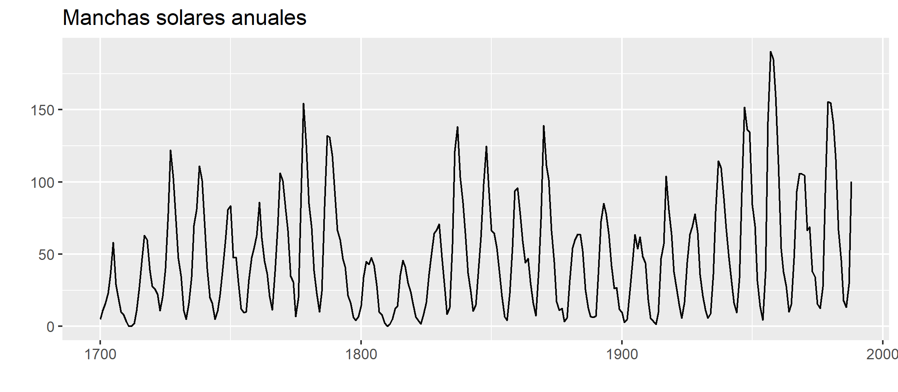
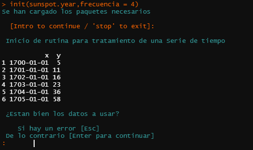
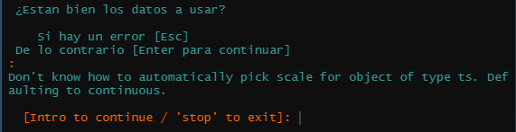
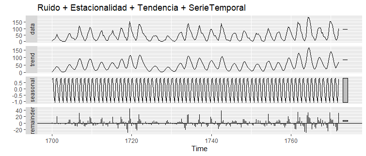
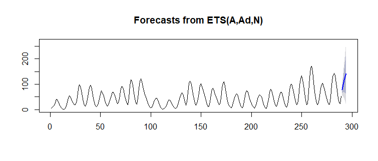

# TSRutina V3.0 Taby

Asistente para el análisis de series de tiempo basado en los modelos simples para series de tiempo univariadas.

Temas tratados:

* Prueba de Estacionariedad
* Suavizamientos 
  * Promedio móvil Simple
  * Promedio móvil Ponderado
  * Exponencial
  * Holt
  * Holt Winter
* Ajustes a modelos ARIMA(p,i,q)
  * Consideramos las aproximaciones:
  * ARIMA(0,0,q)=Ma(q)
  * ARIMA(p,0,0)=Ar(p)
  * ARIMA(p,0,q)=ARMA(p,q)

El asistente contiene un generador de gráficas de los Suavizamientos anteriores que permite almacenar los gráficos en el directorio de trabajo, pendiente capacidad de ajuste de calidad y dimensiones en las imágenes PNG \{x|Taby 3.x > 3.1\}

Se realizan múltiples pruebas estadísticas que permite tomar decisiones sobre si la serie se ajusta o no a la lista de supuestos de algún modelo.

Esta paqueteria tiene una documentación en la mayoría de las funciones, si se tiene duda de su uso o que hacen algunas funciones no dudes en usar la documentación que se instala junto a la paqueteria. Ejemplo:
```r
#acceder a la documentación de la función init()
library('TSRutina')
?init
```

Ejemplo de uso y salidas
=================


### Instalación

Primeros pasos, instalación y uso:
```r
#Previos
install.packages('devtools')
library('devtools')
#TSRutina
install_github("crissthiandi/TSRutina@v3.0",force = TRUE)
library('TSRutina')
```
### Rutina init()

La idea principal es solo correr una función a la cual *se le pasaran la menor cantidad de parámetros posibles*. Parámetros con los que la función realizara todo el proceso de análisis. ```init()``` es la función encargada de esta tarea.

Tomemos la base de datos **sunspot.year** la cual tiene las manchas solares anuales entre los años 1749 y 1983.


luego llamemos a ```init(sunspot.year)``` y obtenemos una análisis de estos datos.

> **Obervación:**
> 
> Como no especificamos la frecuencia se usa la frecuencia del objeto *TS* y como esa frecuencia es igual a **1** entonces obtendremos un ERROR o aviso eventualmente porque la serie de tiempo *sunspot.year* no tiene frecuencia mayor a 1. Se puede omitir o modificar la frecuencia si creemos que existe algun valor de interés. Por ejemplo Creemos que cada 10 años hay un ciclo en estas manchas solares.
> Si queremos hacer esto no necesitamos editar el objeto TS *sunspot.year* externamente, si no usando las misma funciones de la paqueteria **TSRutina**. Ejemplo:
```r
init(sunspot.year,frecuencia = 10) #Editando la frecuencia del objeto TS
```
##### Outputs

Las interacciónes con el asistente son de la forma:
```bash
Pregunta => Mensaje => Respuesta del usuario => Resultado
```
En la mayoria de los casos los mensajes son impresiones de color **azul** similares a los mensajes clasicos. Aunque en las futuras versiónes se usaran otros colores que podran dar una mejor idea de cuando inicia o termina un mensaje.

Para la función ```init()``` la primera Pregunta y Mensaje son los siguientes


Esta primera salida nos pedira confirmar si los datos son bien interpretados por la *rutina*. De marchar todo bien, se ingresa *intro* para continuar, de lo contrario, si hay un error inserte o oprima *Esc* para abortar la rutina.

Despues de brincar este filtro tendremos lo que en general seran los filtros *pausa*, que son momentos en los que la función muestra un resultado (grafico o estadistico) y espera que el usuario confirme para continuar (en ese momento la función espera a que el usuario analise la salida y decida si continuar con la rutina de analisis).



#### Salida de la Función init(sunspot.year)

La primera salida de la función **init(sunspot.year)** es un vistazo a la serie de tiempo.


La segunda salida es una descomposición de la serie de tiempo apartir del *ruido, estacionalidad y tendencia*.




Al final se obtiene el mejor ajuste de la lista de suavizamiento posibles, junto con su predicción a 12 periodos:



#### Suprimir los mensajes y aceptar las sugerencias

Algunas veces el analista o usuario de la paqueteria **TSRutina** puede confiar en el criterio de la función para la propuesta de modelos o no tener mucha idea de cual es el mejor orden de los modelos. En tal caso puede aceptar que *el asistente  realice el mejor ajuste únicamente con sus propuestas sin ayuda del usuario*.

Lo anterior se logra suprimiendo los mensajes tipo pregunta de la rutina, con el siguiente parámetro se obtiene lo deseado:
```r
init(sunspot.year,10,msg = FALSE) #La rutina no hace preguntas
```


