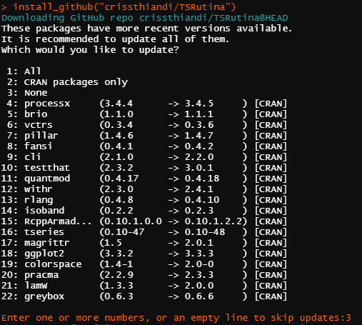

# TSRutina V3.2 Tabi [en desarrollo]

Asistente para el análisis de series de tiempo basado en los modelos para series de tiempo univariadas.

Modelos y temas a tratar:

* Prueba de Estacionariedad
* Suavizamientos 
  * Promedio móvil Simple
  * Promedio móvil Ponderado
  * Exponencial
  * Holt
  * Holt Winter
* Ajustes a modelos ARIMA(p,i,q)
  * Consideramos las aproximaciones:
  * ARIMA(0,0,q)=Ma(q)
  * ARIMA(p,0,0)=Ar(p)
  * ARIMA(p,0,q)=ARMA(p,q)
* Modelo de calibrado Bayesiano profeta. 

El asistente contiene un generador de gráficas de los Suavizamientos anteriores que permite almacenar los gráficos en el directorio de trabajo, pendiente capacidad de ajuste de calidad y dimensiones en las imágenes PNG \{x|Taby 3.x > 3.1\}

Se realizan múltiples pruebas estadísticas que permite tomar decisiones sobre si la serie se ajusta o no a la lista de supuestos de algún modelo.

Esta paqueteria tiene una documentación en la mayoría de las funciones, si se tiene duda de su uso o que hacen algunas funciones no dudes en usar la documentación que se instala junto a la paqueteria. Ejemplo:
```r
#acceder a la documentación de la función init()
library('TSRutina')
?init
```

Ejemplo de uso y salidas
=================


### Instalación

Primeros pasos, instalación de la versión tabi 3.1
```r
#Previos
install.packages('devtools')
library('devtools')
#TSRutina
install_github("crissthiandi/TSRutina@3.1",force = TRUE)
library('TSRutina')
```
Instalación de **la versión más reciente** en desarrollo.
```r
#Previos
install.packages('devtools')
library('devtools')
#TSRutina
install_github("crissthiandi/TSRutina")
library('TSRutina')
```
Luego de esto aparecerá el mensaje siguiente:



Como en la imagen selecciona la opción 3 (none) ya que la instalación de todas esas paqueterias puede ser algo tardado e postergable.

### Rutina init()

La idea principal es correr una sola función a la cual *alimentar con la menor cantidad de parámetros posibles*. Parámetros con los que la función realizara todo el proceso de análisis. ```init()``` es la función encargada de esta tarea.

Tomemos la base de datos **sunspot.year** la cual tiene las manchas solares anuales entre los años 1749 y 1983.


luego llamemos a ```init(sunspot.year)``` y obtenemos una análisis de estos datos.

> **Obervación:**
> 
> Como no especificamos la frecuencia se usa la frecuencia del objeto *TS* y como esa frecuencia es igual a **1** entonces obtendremos un ERROR o aviso eventualmente porque la serie de tiempo *sunspot.year* no tiene frecuencia mayor a 1. Se puede omitir o modificar la frecuencia si creemos que existe algun valor de interés. Por ejemplo Creemos que cada 10 años hay un ciclo en estas manchas solares.
> Si queremos hacer esto no necesitamos editar el objeto TS *sunspot.year* externamente, se puede usar el parametro frecuencia para ello. Ejemplo:
```r
init(sunspot.year,frecuencia = 10) #Editando la frecuencia del objeto TS
```
##### Outputs

Las interacciones con el asistente son de la forma:
```bash
Pregunta => Mensaje => Respuesta del usuario => Resultado
```
En la mayoría de los casos los mensajes son impresiones de color **azul** similares a los mensajes clásicos. Aunque en las futuras versiones se usaran otros colores que podrán dar una mejor idea de cuando inicia o termina un mensaje.

Para la función ```init()``` la primera Pregunta y Mensaje son las siguientes


Esta primera salida nos pedirá confirmar si los datos son bien interpretados por la *rutina*. De marchar todo bien, se ingresa *intro* para continuar, de lo contrario, si hay un error inserte o oprima *Esc* para abortar la rutina.

Después de brincar este filtro tendremos lo que en general serán los filtros *pausa*, que son momentos en los que la función muestra un resultado (gráfico o estadístico) y espera que el usuario confirme para continuar (en ese momento la función espera a que el usuario analice la salida y decida si continuar con la rutina de análisis).


#### Salida de la Función init(sunspot.year)

La primera salida de la función **init(sunspot.year)** es un vistazo a la serie de tiempo.


La segunda salida es una descomposición de la serie de tiempo a partir del *ruido, estacionalidad y tendencia*.


Al final se obtiene el mejor ajuste de la lista de suavizamiento posibles, junto con su predicción a 12 periodos:


#### Suprimir los mensajes y aceptar las sugerencias

Algunas veces el analista o usuario de la paqueteria **TSRutina** puede confiar en el criterio de la función para la propuesta de modelos o no tener mucha idea de cual es el mejor orden de los modelos. En tal caso puede aceptar que *el asistente  realice el mejor ajuste únicamente con sus propuestas sin ayuda del usuario*.

Lo anterior se logra suprimiendo los mensajes tipo pregunta de la rutina, con el siguiente parámetro se obtiene lo deseado:
```r
init(sunspot.year,10,msg = FALSE) #La rutina no hace preguntas
```


