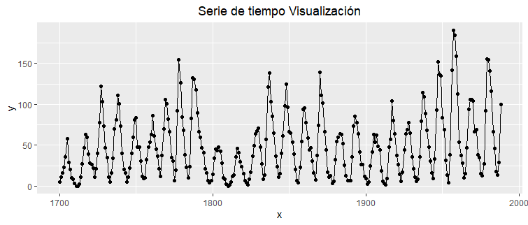

# TSRutina

Asistente para el análisis de series de tiempo, permite mantener un flujo de trabajo mecánico y basado en la metodología definida en un curso introductorio.

Temas tratados:
* Prueba de Estacionariedad
* Suavizamientos 
  * Promedio movil Simple
  * Promedio movil Ponderado
  * Exponencial
  * Holt
  * Holt Winter
* Ajustes a modelos ARIMA(p,i,q)
  * Consideramos las aproximaciónes:
  * ARIMA(0,0,q)=Ma(q)
  * ARIMA(p,0,0)=Ar(p)

Contiene un generador de graficas de los ajustes al igual que un metodo de escritura en disco duro, pendiente capacidad de ajuste de calidad y dimensiones.

## Ejemplo de uso

### Instalación

Primeros pasos, instalación y uso:
```python
#Previos
install.packages('devtools')
library('devtools')
#TSRutina
install_github("crissthiandi/TSRutina@v2.0",force = TRUE)
library('TSRutina')
```
### Rutina init()

La idea principal es solo correr una función a la cual se le pasan la menor cantidad de parametros posibles y que con ello la función realice todo el proceso de analisis. ```init()``` es la función encargada de esta tarea.

Tomemos la base de datos **sunspot.year** la cual tiene las manchas solares anuales entre los años 1749 y 1983.


luego llamemos a ```init(sunspot.year)``` y obtenemos una analisis de estos datos.

```r
init(sunspot.year,frecuencia=4)
```


Esta primera salida nos pedira confirmar si los datos son bien interpretados por la *rutina*. De marchar todo bien, *intro* para continuar, de lo contrario si hay un error *esc* para abortar la rutina.

Despues de brincar este filtro tendremos lo que en general seran los filtros *pausa*, que son momentos en los que la función muestra un resultado (grafico o estadistico). En ese momento la función espera a que el usuario analise la salida y decida continuar con la rutina de analisis.


### Salida de la Función init() (caso sunspot.year)

La primera salida de función init() es un vistazo a la serie de tiempo.



La segunda salida es una descomposición de la serie de tiempo apartir del ruido, estacionalidad y tendencia.


